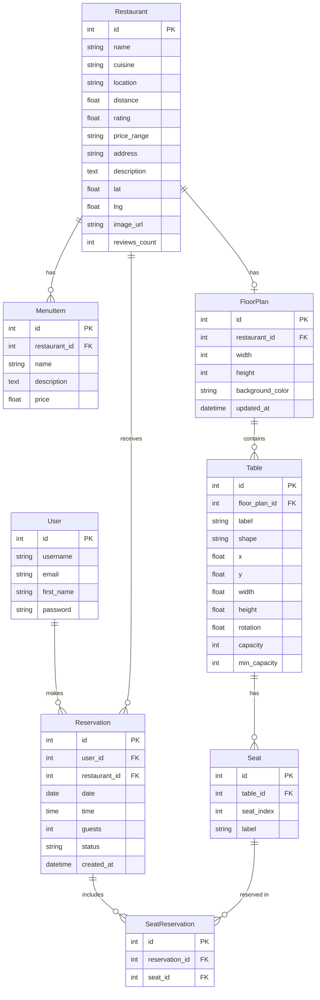

# Database Schema

[[Home|← Volver al Home]]

## Diagrama Entidad-Relación

---

## 📋 Modelos Detallados

### `Restaurant`
**Archivo**: `backend/api/models.py`

| Campo | Tipo | Descripción |
|-------|------|-------------|
| `name` | CharField | Nombre del restaurante |
| `cuisine` | CharField | Tipo de cocina |
| `location` | CharField | Ciudad/zona |
| `distance` | FloatField | Distancia en km |
| `rating` | FloatField | Calificación (0.0 - 5.0) |
| `price_range` | CharField | Ej: `$`, `$$`, `$$$` |
| `address` | CharField | Dirección completa |
| `description` | TextField | Descripción larga |
| `lat` / `lng` | FloatField | Coordenadas GPS |
| `image_url` | URLField | URL de imagen |
| `reviews_count` | IntegerField | Número de reseñas |

> [!info] Ordenamiento
> Los restaurantes se ordenan por `-rating` (mayor rating primero).

---

### `MenuItem`
| Campo | Tipo | Descripción |
|-------|------|-------------|
| `restaurant` | FK → Restaurant | Restaurante al que pertenece |
| `name` | CharField | Nombre del plato |
| `description` | TextField | Descripción |
| `price` | FloatField | Precio |

---

### `Reservation`
| Campo | Tipo | Descripción |
|-------|------|-------------|
| `user` | FK → User | Usuario que reserva |
| `restaurant` | FK → Restaurant | Restaurante reservado |
| `date` | DateField | Fecha de la reserva |
| `time` | TimeField | Hora de la reserva |
| `guests` | IntegerField | Nº comensales (1-20) |
| `status` | CharField | `confirmed` o `cancelled` |
| `created_at` | DateTimeField | Timestamp de creación |

> [!warning] Validación
> `guests` debe estar entre 1 y 20. Se valida en el serializer.

> [!info] Ordenamiento
> Ordenadas por `-date`, `-time` (más recientes primero).

---

### `FloorPlan`
| Campo | Tipo | Descripción |
|-------|------|-------------|
| `restaurant` | OneToOneField → Restaurant | Cada restaurante tiene un plano |
| `width` | IntegerField | Ancho del canvas (default: 1000) |
| `height` | IntegerField | Alto del canvas (default: 700) |
| `background_color` | CharField | Color hex del fondo (default: `#F8F9FA`) |
| `updated_at` | DateTimeField | Última actualización |

---

### `Table`
| Campo | Tipo | Descripción |
|-------|------|-------------|
| `floor_plan` | FK → FloorPlan | Plano al que pertenece |
| `label` | CharField | Etiqueta (ej: "T1", "Mesa A") |
| `shape` | CharField | `round`, `square` o `rectangular` |
| `x` / `y` | FloatField | Posición en el canvas |
| `width` / `height` | FloatField | Dimensiones |
| `rotation` | FloatField | Rotación en grados |
| `capacity` | IntegerField | Capacidad máxima |
| `min_capacity` | IntegerField | Capacidad mínima |

---

### `Seat`
| Campo | Tipo | Descripción |
|-------|------|-------------|
| `table` | FK → Table | Mesa a la que pertenece |
| `seat_index` | IntegerField | Índice del asiento (0, 1, 2...) |
| `label` | CharField | Etiqueta (ej: "T1-A", "T1-B") |

> [!info] Unicidad
> La combinación `(table, seat_index)` debe ser única.

**Etiquetado automático**: Los asientos se etiquetan con letras: A, B, C, D...
Ejemplo para mesa "T1" con 4 asientos: `T1-A`, `T1-B`, `T1-C`, `T1-D`

---

### `SeatReservation` (Junction Table)
| Campo | Tipo | Descripción |
|-------|------|-------------|
| `reservation` | FK → Reservation | Reserva a la que pertenece |
| `seat` | FK → Seat | Asiento reservado |

> [!info] Unicidad
> La combinación `(reservation, seat)` debe ser única — no se puede reservar el mismo asiento dos veces en la misma reserva.

---

## 🗄️ Bases de Datos

| Entorno | Motor | Configuración |
|---------|-------|--------------|
| Desarrollo | SQLite3 | `backend/db.sqlite3` |
| Producción | PostgreSQL | Variable `DATABASE_URL` de Railway |

> [!tip] Cambio automático
> Django detecta si existe `DATABASE_URL` y usa PostgreSQL en producción. De lo contrario, usa SQLite3.

---

## 🔗 Links Relacionados

- [[Models]] — Código detallado de los modelos
- [[API Endpoints]] — Cómo se exponen estos datos
- [[Reservation System]] — Lógica de reservas
- [[Floor Plan System]] — Sistema de planos y asientos
