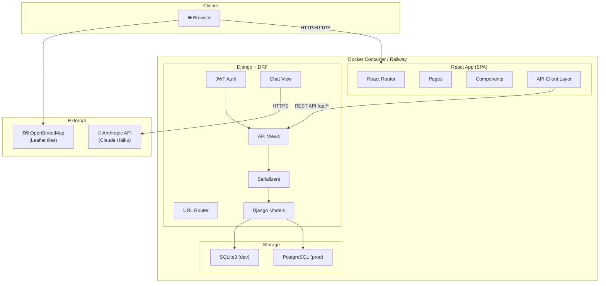
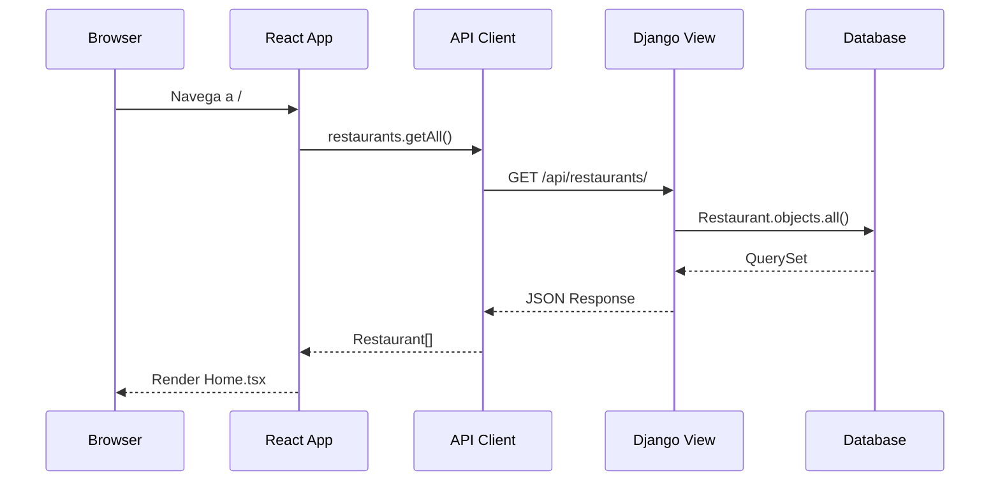
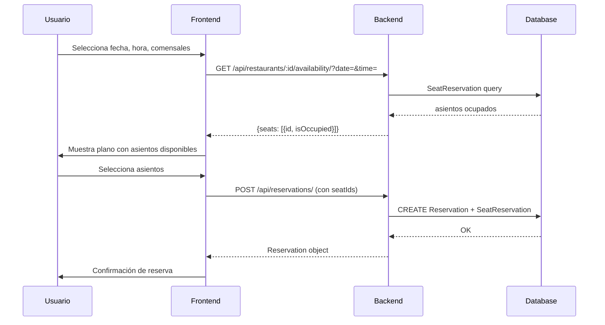

# System Architecture

[[Home|← Volver al Home]]

## Visión General

Reservia es una arquitectura **monolítica desplegada en un solo contenedor**, donde Django sirve tanto la API REST como el bundle estático del frontend React.

---

## 🏗️ Diagrama de Arquitectura

---

## 🔄 Flujo de Peticiones

### Request Típico (ej: listar restaurantes)

### Flujo de Reserva con Asientos

---

## 📁 Separación de Capas

| Capa | Ubicación | Responsabilidad |
|------|-----------|----------------|
| Presentación | `frontend/src/pages/` | UI, routing |
| Lógica UI | `frontend/src/components/` | Componentes reutilizables |
| API Client | `frontend/src/api/` | Comunicación con backend |
| Estado global | `frontend/src/context/` | Auth state |
| API REST | `backend/api/views.py` | Endpoints HTTP |
| Serialización | `backend/api/serializers.py` | Validación y transformación |
| Modelos | `backend/api/models.py` | Lógica de negocio y DB |
| Configuración | `backend/reservia/settings.py` | Config Django |

---

## 🌐 Estrategia de Despliegue

Django actúa como **servidor único** que:
1. Sirve la API en `/api/*`
2. Sirve los archivos estáticos del frontend en `/static/`
3. Para cualquier ruta que no sea `/api/*`, devuelve el `index.html` del SPA (`views_frontend.py`)

> [!info] Sin servidor separado para el frontend
> No hay Nginx ni servidor de archivos separado. WhiteNoise maneja los estáticos y Django sirve el SPA.

---

## 🔐 Seguridad

- **CORS**: Configurado con `django-cors-headers`, permitiendo solo orígenes conocidos
- **JWT**: Tokens con expiración de 7 días (access) / 30 días (refresh)
- **HTTPS**: Gestionado por Railway en producción
- **SECRET_KEY**: Inyectado vía variable de entorno

---

## 🔗 Links Relacionados

- [[Project Structure]] — Árbol de archivos detallado
- [[API Endpoints]] — Todas las rutas REST
- [[Docker Setup]] — Cómo se empaqueta todo
- [[Authentication]] — Sistema de autenticación
