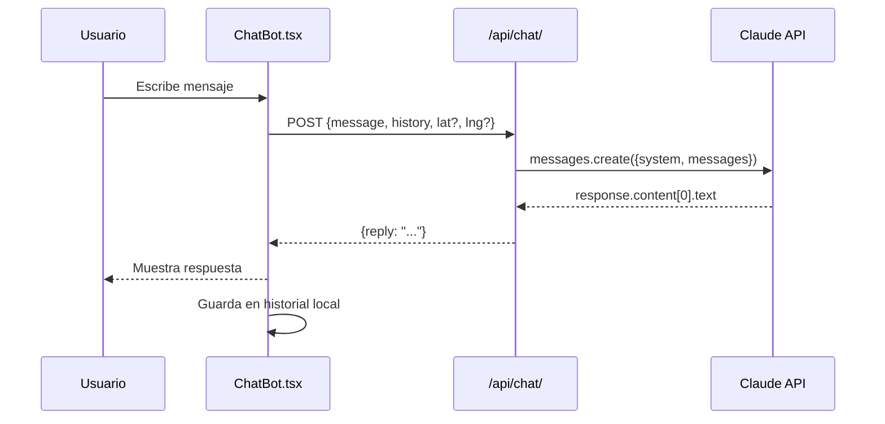

# AI Chat Integration

[[Home|← Volver al Home]]

## Overview

Reservia integra **Anthropic Claude** para ofrecer un chatbot conversacional que ayuda a los usuarios a descubrir restaurantes y hacer recomendaciones personalizadas.

---

## 🤖 Configuración del Modelo

| Parámetro | Valor |
|-----------|-------|
| Modelo | `claude-haiku-4-5-20251001` |
| Max tokens | 400 |
| Historial máximo | Últimas 10 interacciones |
| Idioma | Auto-detectado (EN/ES) |
| Auth | API Key vía variable de entorno |

---

## 📡 Endpoint

```
POST /api/chat/
```

**No requiere autenticación** — el chat es público.

Ver detalles completos en [[API Endpoints#🤖 Chat IA]].

---

## ⚙️ Implementación Backend

**Archivo**: `backend/api/views.py`

```python
class ChatView(APIView):
    def post(self, request):
        message = request.data.get('message', '')
        history = request.data.get('history', [])[-10:]  # últimas 10
        lat = request.data.get('lat')
        lng = request.data.get('lng')

        # Construye contexto de restaurantes
        restaurants = Restaurant.objects.all()
        restaurant_context = self._build_restaurant_context(restaurants)

        # Contexto de ubicación si está disponible
        location_context = ""
        if lat and lng:
            location_context = f"User location: {lat}, {lng}"

        # System prompt
        system_prompt = f"""You are a helpful restaurant recommendation assistant for ReserVia.

Available restaurants:
{restaurant_context}

{location_context}

Respond in the same language as the user (English or Spanish).
Keep responses concise (max 200 words).
Help users find the perfect restaurant and make reservations."""

        # Llamada a Claude
        client = anthropic.Anthropic(api_key=settings.ANTHROPIC_API_KEY)
        response = client.messages.create(
            model="claude-haiku-4-5-20251001",
            max_tokens=400,
            system=system_prompt,
            messages=[
                *history,
                {"role": "user", "content": message}
            ]
        )

        return Response({"reply": response.content[0].text})
```

---

## 🧠 System Prompt

El asistente recibe contexto sobre:

1. **Todos los restaurantes**: nombre, cocina, rating, precio, descripción
2. **Ubicación del usuario** (opcional): coordenadas GPS para recomendaciones por distancia
3. **Instrucciones de comportamiento**:
   - Responder en el idioma del usuario (EN/ES)
   - Máximo 200 palabras por respuesta
   - Ayudar a encontrar restaurantes y hacer reservas

---

## 💬 Flujo de Conversación



---

## 🖥️ Implementación Frontend

**Archivo**: `frontend/src/components/ChatBot.tsx`
**API client**: `frontend/src/api/chat.ts`

### Estado del chatbot
```typescript
interface Message {
    role: 'user' | 'assistant'
    content: string
}

const [messages, setMessages] = useState<Message[]>([])
const [isOpen, setIsOpen] = useState(false)
```

### Geolocalización
```typescript
// El chatbot solicita ubicación del browser
navigator.geolocation.getCurrentPosition(
    (position) => {
        setLocation({
            lat: position.coords.latitude,
            lng: position.coords.longitude
        })
    }
)
```

---

## 🌐 Soporte Multiidioma

El chatbot detecta automáticamente el idioma del usuario:
- Si el usuario escribe en **español** → responde en español
- Si el usuario escribe en **inglés** → responde en inglés
- Consistente con la configuración i18n de la app

---

## 🔑 Configuración de API Key

**Variable de entorno requerida**:
```env
ANTHROPIC_API_KEY=sk-ant-api03-...
```

> [!warning] Seguridad
> La API key se mantiene en el backend. El frontend nunca tiene acceso directo a la clave de Anthropic.

Ver [[Environment Variables]] para configuración completa.

---

## 💡 Casos de Uso del Chatbot

- "¿Qué restaurante italiano me recomiendas?"
- "Busco algo económico cerca de mí"
- "¿Cuál tiene mejor rating?"
- "Necesito un sitio para una cena romántica"
- "¿Qué restaurantes tienen opciones veganas?"

---

## 🔗 Links Relacionados

- [[API Endpoints]] — Endpoint `/api/chat/`
- [[Environment Variables]] — `ANTHROPIC_API_KEY`
- [[Tech Stack]] — Anthropic SDK en las dependencias
