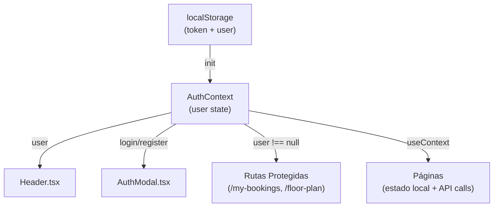

# State Management

[[Home|← Volver al Home]]

## Arquitectura de Estado

Reservia usa un enfoque **minimalista** de gestión de estado:
- **Estado global**: Solo para autenticación vía `AuthContext`
- **Estado local**: `useState` en cada componente/página
- **No hay Redux**, Zustand ni otras librerías de estado

---

## 🔐 AuthContext

**Archivo**: `frontend/src/context/AuthContext.tsx`

El único estado global de la aplicación es el estado de autenticación.

### Estructura del Contexto

```typescript
interface AuthContextType {
  user: User | null
  login: (email: string, password: string) => Promise<void>
  register: (name: string, email: string, password: string) => Promise<void>
  logout: () => void
  isLoading: boolean
}

interface User {
  id: number
  name: string
  email: string
}
```

### Inicialización

Al cargar la app, el contexto intenta restaurar la sesión desde `localStorage`:

```typescript
const AuthProvider = ({ children }) => {
  const [user, setUser] = useState<User | null>(null)

  useEffect(() => {
    // Restaurar sesión al recargar la página
    const savedUser = localStorage.getItem('reservia_user')
    const savedToken = localStorage.getItem('reservia_token')

    if (savedUser && savedToken) {
      setUser(JSON.parse(savedUser))
    }
  }, [])
```

### Método `login`

```typescript
const login = async (email: string, password: string) => {
  const response = await authApi.login({ email, password })
  localStorage.setItem('reservia_token', response.token)
  localStorage.setItem('reservia_user', JSON.stringify(response.user))
  setUser(response.user)
}
```

### Método `logout`

```typescript
const logout = () => {
  localStorage.removeItem('reservia_token')
  localStorage.removeItem('reservia_user')
  setUser(null)
}
```

---

## 📡 API Client Layer

**Directorio**: `frontend/src/api/`

El estado del servidor se gestiona directamente con `fetch` sin librerías de cache como React Query.

### Estructura del cliente base (`client.ts`)

```typescript
const apiCall = async (endpoint: string, options?: RequestInit) => {
  const token = localStorage.getItem('reservia_token')

  const response = await fetch(`${API_BASE_URL}${endpoint}`, {
    ...options,
    headers: {
      'Content-Type': 'application/json',
      ...(token ? { Authorization: `Bearer ${token}` } : {}),
      ...options?.headers,
    },
  })

  if (!response.ok) throw new Error(await response.text())
  return response.json()
}
```

### Módulos de API

| Módulo | Archivo | Endpoints |
|--------|---------|-----------|
| Auth | `auth.ts` | login, register |
| Restaurants | `restaurants.ts` | getAll, getById, getCuisines |
| Reservations | `reservations.ts` | create, getMyReservations, cancel |
| Floor Plan | `floorPlan.ts` | get, getAvailability, update |
| Chat | `chat.ts` | sendMessage |

---

## 📦 Estado Local por Página

### `Home.tsx`
```typescript
const [restaurants, setRestaurants] = useState<Restaurant[]>([])
const [cuisines, setCuisines] = useState<string[]>([])
const [searchQuery, setSearchQuery] = useState('')
const [selectedCuisine, setSelectedCuisine] = useState<string | null>(null)
const [isLoading, setIsLoading] = useState(true)
```

### `RestaurantDetails.tsx`
```typescript
const [restaurant, setRestaurant] = useState<Restaurant | null>(null)
const [floorPlan, setFloorPlan] = useState<FloorPlanData | null>(null)
const [availability, setAvailability] = useState<SeatAvailability[]>([])
const [selectedSeats, setSelectedSeats] = useState<number[]>([])
const [date, setDate] = useState('')
const [time, setTime] = useState('')
const [guests, setGuests] = useState(2)
const [bookingSuccess, setBookingSuccess] = useState(false)
```

### `MyBookings.tsx`
```typescript
const [reservations, setReservations] = useState<Reservation[]>([])
const [isLoading, setIsLoading] = useState(true)
```

---

## 🔄 Flujo de Datos



---

## 🔗 Links Relacionados

- [[Authentication]] — Sistema JWT del backend
- [[Pages & Routing]] — Estado local de cada página
- [[Components]] — Componentes que consumen AuthContext
