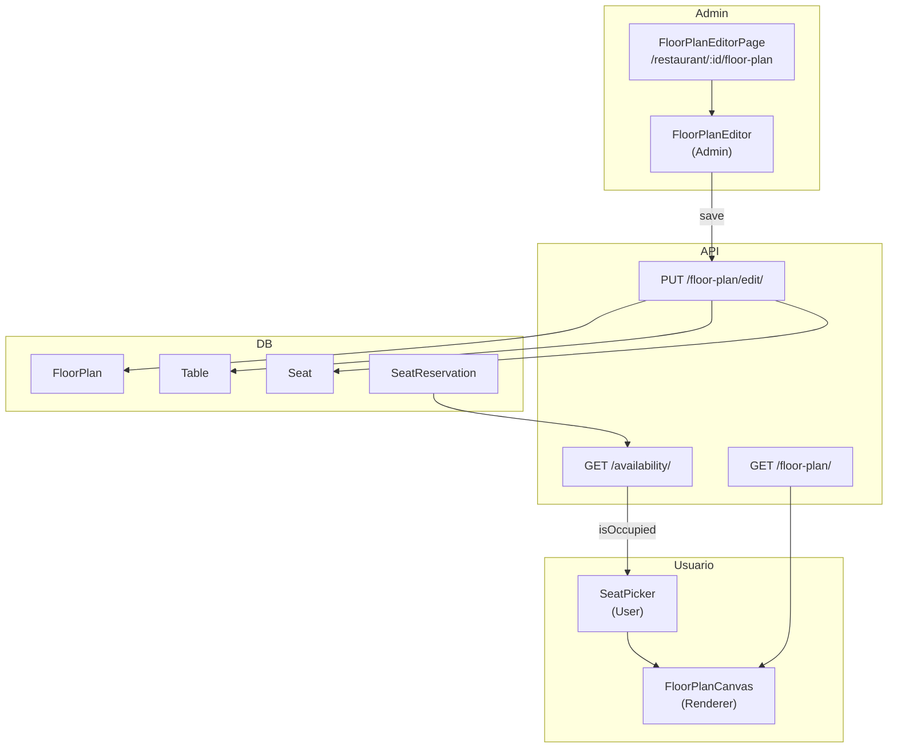
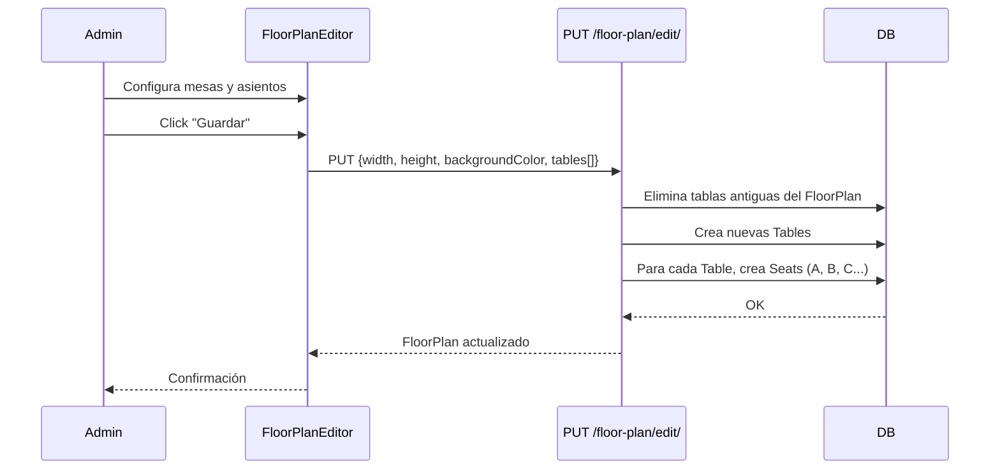

# Floor Plan System

[[Home|← Volver al Home]]

## Overview

El sistema de planos de piso permite a los restaurantes configurar visualmente la distribución de sus mesas, y a los usuarios seleccionar asientos específicos al reservar.

---

## 🏗️ Arquitectura del Sistema



---

## 📐 Componentes

### `<FloorPlanCanvas />`
Renderer SVG puro del plano. Dibuja mesas y asientos sin interacción.

**Renderizado de formas**:
| Shape | Rendering SVG |
|-------|--------------|
| `round` | `<circle>` |
| `square` | `<rect>` con `rx=0` |
| `rectangular` | `<rect>` con dimensiones distintas |

**Posicionamiento de asientos**: Calculado por `seatGeometry.ts`:
```typescript
// utils/seatGeometry.ts
export const getSeatPositions = (
  table: Table,
  seatCount: number
): SeatPosition[] => {
  // Para mesas redondas: distribución circular
  // Para mesas cuadradas/rectangulares: distribución perimetral
  ...
}
```

---

### `<SeatPicker />`
Vista interactiva del plano para usuarios haciendo una reserva.

**Estado visual por asiento**:
```typescript
const getSeatColor = (seat: SeatAvailability, isSelected: boolean) => {
  if (isSelected) return '#f97415'        // Naranja - seleccionado
  if (seat.isOccupied) return '#EF4444'   // Rojo - ocupado
  return '#10B981'                         // Verde - disponible
}
```

**Interacción**:
- Click en asiento disponible → selecciona/deselecciona
- No se puede clickear asientos ocupados
- Límite de selección = número de comensales

---

### `<FloorPlanEditor />`
Editor drag-and-drop para administradores.

**Operaciones**:
- **Añadir mesa**: Formulario con todos los campos
- **Editar mesa**: Click en mesa → panel de edición
- **Eliminar mesa**: Botón eliminar en panel
- **Posicionar**: Ingreso manual de coordenadas X/Y
- **Guardar**: PUT al backend con toda la configuración

---

### `<Legend />`
Leyenda de colores para el SeatPicker:
- 🟢 Verde = Disponible
- 🔴 Rojo = Ocupado
- 🟠 Naranja = Seleccionado

---

## 🗄️ Modelos de Datos

### Estructura de un FloorPlan completo

```json
{
  "hasFloorPlan": true,
  "floorPlan": {
    "id": 1,
    "width": 1000,
    "height": 700,
    "backgroundColor": "#F8F9FA",
    "tables": [
      {
        "id": 1,
        "label": "T1",
        "shape": "round",
        "x": 150,
        "y": 200,
        "width": 80,
        "height": 80,
        "rotation": 0,
        "capacity": 4,
        "minCapacity": 1,
        "seats": [
          { "id": 1, "seatIndex": 0, "label": "T1-A" },
          { "id": 2, "seatIndex": 1, "label": "T1-B" },
          { "id": 3, "seatIndex": 2, "label": "T1-C" },
          { "id": 4, "seatIndex": 3, "label": "T1-D" }
        ]
      }
    ]
  }
}
```

---

## 🔄 Proceso de Guardado (Admin)



> [!warning] Reemplazo completo
> Al guardar, el backend elimina **todas** las mesas y asientos anteriores y los recrea. No hace upserts individuales.

---

## 📏 Canvas Dimensions

| Dimensión | Default | Descripción |
|-----------|---------|-------------|
| width | 1000px | Ancho del área de diseño |
| height | 700px | Alto del área de diseño |
| backgroundColor | `#F8F9FA` | Color de fondo |

---

## 🏗️ Generación de Asientos en Seed

```python
# management/commands/seed.py
letters = 'ABCDEFGHIJKLMNOPQRSTUVWXYZ'
for i in range(table.capacity):
    Seat.objects.create(
        table=table,
        seat_index=i,
        label=f"{table.label}-{letters[i]}"
    )
# T1 con capacity=4 → T1-A, T1-B, T1-C, T1-D
```

---

## 🔗 Links Relacionados

- [[Reservation System]] — Cómo se usa el floor plan en reservas
- [[Database Schema]] — Modelos FloorPlan, Table, Seat
- [[API Endpoints]] — Endpoints de floor plan y disponibilidad
- [[Database Seeding]] — Cómo se generan los planos iniciales
