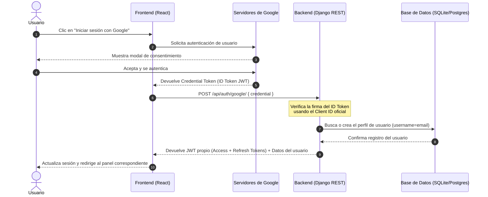

# 📖 Fase 1 — Conexión de Google OAuth (reservia.website)

> **Fecha de Implementación**: 2026-06-02
> **Estado**: Completado / Validado Localmente
> **Rama de Git**: `main` (Pendiente de confirmación)

---

## 🏛️ 1. Arquitectura y Flujo

El sistema de autenticación social con Google OAuth está diseñado de forma desacoplada para garantizar velocidad y seguridad mediante los siguientes pasos de comunicación:



---

## 🛠️ 2. Detalles de Implementación

### Backend (Django)
- **Modelos**: Utiliza el modelo estándar de Django `User` e interactúa indirectamente con `UserProfile` a través de señales automáticas.
- **Endpoints**:
  * `POST /api/auth/google/` ➔ Gestionado en `backend/api/views_auth.py` a través de la función `google_auth_view`.
- **Librería Utilizada**: `google-auth` para validar de forma criptográfica la autenticidad de la firma y los claims del token.
- **Seguridad**: Se inyecta `GOOGLE_CLIENT_ID` desde el entorno para evitar hardcodeo de claves.

### Frontend (React)
- **Componentes**: 
  * `<GoogleOAuthProvider>` en `src/main.tsx` inicializa la SDK de Google con el Client ID de producción o local de forma dinámica.
  * `<GoogleLogin>` (de `@react-oauth/google`) en `AuthModal.tsx` renderiza el botón nativo de Google y gestiona los callbacks de éxito y error.
- **Manejo de Estado**: `AuthContext` actualiza el token JWT local y las cookies tras la validación exitosa del backend.

---

## 🚨 3. Problemas Detectados y Soluciones

### 💥 Bloqueo 1: Error `INVALID GOOGLE TOKEN` en local
* **Descripción**: Al intentar autenticar en local, el backend rechazaba el token de Google devolviendo un código 401 debido a que los servidores de desarrollo no habían recargado las nuevas variables de entorno de Google Client ID y se producía una discrepancia.
* **Solución**: 
  1. Se mejoró el código del backend en `views_auth.py` para capturar el error detallado de la excepción `ValueError` y retornarlo directamente en la respuesta HTTP para facilitar el diagnóstico.
  2. Se detuvo y reinició por completo la suite local (`./run-dev.sh`) para forzar la carga en memoria de las variables `.env` y `.env.local`.

---

## 🧪 4. Registro de Pruebas y Validación

### Pruebas Unitarias y de Integración
Se ejecutó la suite de validación completa del proyecto (`bash scripts/validate.sh`) resultando en éxito rotundo:
- **Backend Tests**: 105 tests completados con éxito (`OK`).
- **Linter Backend (Bandit SAST)**: Completado sin vulnerabilidades encontradas.
- **Frontend Build**: Transpilación y minificación exitosas (`tsc + vite`).
- **Frontend Linter (ESLint)**: Completado sin errores.
- **Frontend Tests (Vitest)**: 28 tests superados con éxito.

```bash
✓ Backend tests: OK
✓ Bandit SAST: OK
✓ Frontend build: OK
✓ Frontend lint: OK
✓ Frontend tests: OK
✓ ════════════════════════════════════
✓   Todo OK — seguro para hacer push  
✓ ════════════════════════════════════
```

### Pruebas Manuales
- **Caso de Prueba 1: Login con usuario nuevo**:
  * **Pasos**: Hacer clic en el botón de Google, autenticarse con una cuenta Gmail no registrada previamente.
  * **Resultado Esperado**: Se crea el registro del usuario con su nombre y apellido de forma transparente y accede como `customer`. (Confirmado).
- **Caso de Prueba 2: Login con usuario existente**:
  * **Pasos**: Iniciar sesión con una cuenta de Google previamente asociada.
  * **Resultado Esperado**: Se detecta el usuario en base de datos y se le expide su token de sesión JWT de inmediato. (Confirmado).

---

## 🧠 5. Lecciones Aprendidas y Deuda Técnica
- **Ajuste de Reloj en local**: La sincronización de hora en local es clave. Si el reloj del sistema tiene desvíos mayores a 300 segundos, la verificación del token de Google fallará por expiración de forma inmediata.
- **Variables Build-Time en Vite**: Las variables que inician con `VITE_` deben cargarse en el momento de compilar el contenedor en GitHub Actions para asegurar que estén inyectadas físicamente en los estáticos del cliente en el VPS de Hetzner.
