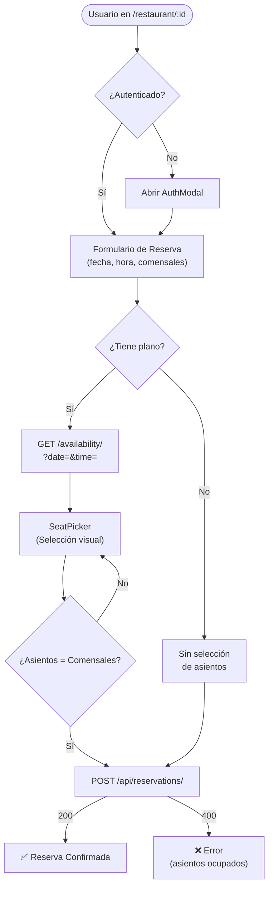

# Reservation System

[[Home|← Volver al Home]]

## Overview

El sistema de reservas permite a los usuarios registrados reservar mesas en restaurantes, opcionalmente seleccionando asientos específicos en el plano de piso.

---

## 🔄 Flujo Completo de Reserva



---

## 📋 Formulario de Reserva

**Ubicación**: `RestaurantDetails.tsx`

Campos del formulario:

| Campo | Tipo | Validación |
|-------|------|-----------|
| Fecha | `date` input | Fecha futura, requerido |
| Hora | `time` input | Requerido |
| Comensales | `number` input | 1-20 |

---

## 💺 Selección de Asientos (Opcional)

Si el restaurante tiene un plano configurado:

1. Se carga la disponibilidad via `GET /api/restaurants/:id/availability/?date=&time=`
2. Se muestra el `<SeatPicker />` con el plano visual
3. Los asientos ocupados se muestran en rojo 🔴
4. Los disponibles en verde 🟢
5. Los seleccionados en amarillo 🟡
6. El usuario selecciona exactamente `guests` asientos

> [!warning] Validación de conteo
> El número de asientos seleccionados debe ser igual al número de comensales antes de poder enviar la reserva.

---

## ✅ Validaciones

### Frontend
- Fecha y hora son requeridas
- Comensales: 1-20
- Si hay plano: asientos seleccionados = comensales

### Backend
```python
# api/serializers.py - ReservationSerializer
class ReservationSerializer(serializers.ModelSerializer):
    def validate_guests(self, value):
        if not 1 <= value <= 20:
            raise serializers.ValidationError("Guests must be between 1 and 20")
        return value

    def validate(self, data):
        seat_ids = self.context.get('seat_ids', [])
        if seat_ids:
            # Verificar que los asientos no están ocupados
            occupied = SeatReservation.objects.filter(
                seat_id__in=seat_ids,
                reservation__status='confirmed',
                reservation__date=data['date'],
                reservation__time=data['time']
            )
            if occupied.exists():
                raise serializers.ValidationError("Some seats are already occupied")
        return data
```

---

## 📡 API de Reservas

### Crear Reserva

```http
POST /api/reservations/
Authorization: Bearer <token>

{
  "restaurantId": 1,
  "date": "2025-12-25",
  "time": "20:00",
  "guests": 2,
  "seatIds": [5, 6]
}
```

**Proceso interno**:
1. Valida autenticación (JWT)
2. Valida los datos del serializer
3. Crea `Reservation` con `status='confirmed'`
4. Si hay `seatIds`, crea registros `SeatReservation` para cada asiento
5. Devuelve la reserva creada

### Ver Mis Reservas

```http
GET /api/reservations/my/
Authorization: Bearer <token>
```

Devuelve todas las reservas del usuario, ordenadas por fecha descendente.

### Cancelar Reserva

```http
DELETE /api/reservations/{id}/
Authorization: Bearer <token>
```

**Nota**: Cambia `status` a `'cancelled'` — no borra el registro.

---

## 🗄️ Modelos Involucrados

| Modelo | Rol |
|--------|-----|
| `Reservation` | Reserva principal |
| `SeatReservation` | Junction table asiento-reserva |
| `Seat` | Asiento individual |

Ver [[Database Schema]] para el diagrama ER completo.

---

## 📊 Estados de una Reserva

| Estado | Descripción |
|--------|-------------|
| `confirmed` | Reserva activa |
| `cancelled` | Reserva cancelada por el usuario |

---

## 🔗 Links Relacionados

- [[Floor Plan System]] — Sistema de planos y asientos
- [[API Endpoints]] — Endpoints de reservas
- [[Authentication]] — Requiere JWT para crear reservas
- [[Database Schema]] — Modelos Reservation y SeatReservation
