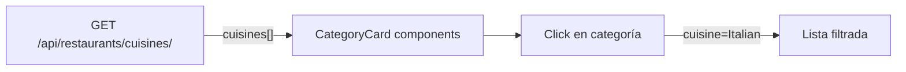

# Restaurant Discovery

[[Home|← Volver al Home]]

## Overview

La funcionalidad de descubrimiento permite a los usuarios explorar, buscar y filtrar los restaurantes disponibles en Reservia.

---

## 🖥️ Interfaz

**Página**: `Home.tsx` (`/`)

La página de inicio contiene:
1. **Hero con buscador** — Campo de búsqueda prominente
2. **Categorías de cocina** — Filtros visuales por tipo
3. **Grid de restaurantes** — Cards de todos los restaurantes

---

## 🔍 Búsqueda

### Frontend
```typescript
// Home.tsx
const [searchQuery, setSearchQuery] = useState('')

// Filtrado en tiempo real o al enviar el formulario
const handleSearch = (query: string) => {
  setSearchQuery(query)
  fetchRestaurants({ search: query, cuisine: selectedCuisine })
}
```

### Backend
```python
# api/views.py - RestaurantListView
class RestaurantListView(APIView):
    def get(self, request):
        queryset = Restaurant.objects.all()

        search = request.query_params.get('search')
        if search:
            queryset = queryset.filter(
                Q(name__icontains=search) |
                Q(cuisine__icontains=search) |
                Q(location__icontains=search)
            )

        cuisine = request.query_params.get('cuisine')
        if cuisine:
            queryset = queryset.filter(cuisine__iexact=cuisine)

        serializer = RestaurantListSerializer(queryset, many=True)
        return Response({
            'restaurants': serializer.data,
            'total': queryset.count()
        })
```

**Búsqueda por**: nombre, tipo de cocina, o ubicación (case-insensitive).

---

## 🏷️ Filtrado por Cocina



El endpoint `GET /api/restaurants/cuisines/` devuelve las cocinas únicas disponibles, calculadas dinámicamente:

```python
class CuisineListView(APIView):
    def get(self, request):
        cuisines = Restaurant.objects.values_list('cuisine', flat=True).distinct()
        return Response(list(cuisines))
```

---

## 🃏 RestaurantCard

Cada restaurante se muestra como una tarjeta con:

| Campo | Descripción |
|-------|-------------|
| Imagen | `image_url` del restaurante |
| Nombre | `name` |
| Cocina | `cuisine` (traducida con i18n) |
| Rating | `rating` con estrellas ⭐ |
| Precio | `price_range` ($, $$, $$$) |
| Ubicación | `location` |
| Distancia | `distance` en km |

**Click** en la tarjeta → navega a `/restaurant/:id`

---

## 📊 Ordenamiento

Los restaurantes se ordenan por **rating descendente** (mayor primero) por defecto, definido en el modelo:

```python
class Restaurant(models.Model):
    class Meta:
        ordering = ['-rating']
```

---

## 🤖 Búsqueda con IA

Además de la búsqueda directa, los usuarios pueden usar el **chatbot** para encontrar restaurantes en lenguaje natural:

- "Quiero algo romántico y no muy caro"
- "¿Qué hay de sushi por aquí cerca?"
- "Recomiéndame el mejor para una cena de negocios"

Ver [[AI Chat Integration]] para más detalles.

---

## 🗺️ Exploración por Mapa

Alternativa a la lista: el **Map Explorer** (`/map`) muestra todos los restaurantes en un mapa interactivo con coordenadas GPS reales.

Ver [[Map Explorer]] para más detalles.

---

## 🔗 Links Relacionados

- [[API Endpoints]] — `GET /api/restaurants/`
- [[Map Explorer]] — Descubrimiento por mapa
- [[AI Chat Integration]] — Búsqueda con IA
- [[Reservation System]] — Siguiente paso tras descubrir un restaurante
