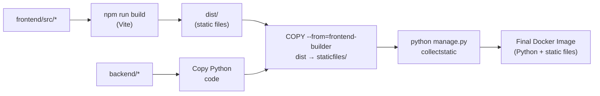

# Docker Setup

[[Home|← Volver al Home]]

## Overview

Reservia usa **Docker** con un **Dockerfile multi-stage** que compila el frontend React y lo integra con el backend Django en un único contenedor.

---

## 🐳 Dockerfile Multi-Stage

**Archivo**: `Dockerfile` (raíz del proyecto)

```dockerfile
# ─────────────────────────────────────
# STAGE 1: Build del Frontend (Node.js)
# ─────────────────────────────────────
FROM node:22-alpine AS frontend-builder

WORKDIR /app/frontend
COPY frontend/package*.json ./
RUN npm ci
COPY frontend/ .
RUN npm run build
# Output: /app/frontend/dist/

# ─────────────────────────────────────
# STAGE 2: Backend Python + Frontend
# ─────────────────────────────────────
FROM python:3.11-slim

# Dependencias del sistema
RUN apt-get update && apt-get install -y \
    build-essential \
    postgresql-client \
    && rm -rf /var/lib/apt/lists/*

WORKDIR /app

# Dependencias Python
COPY backend/requirements.txt .
RUN pip install --no-cache-dir -r requirements.txt

# Código del backend
COPY backend/ .

# Copia el build del frontend al directorio de estáticos de Django
COPY --from=frontend-builder /app/frontend/dist ./staticfiles/

# Colecta archivos estáticos (WhiteNoise)
RUN python manage.py collectstatic --noinput

# Startup: migraciones + seed + servidor
CMD sh -c "python manage.py migrate --noinput && \
           python manage.py seed && \
           gunicorn -w 3 reservia.wsgi:application --bind 0.0.0.0:$PORT"
```

---

## 🔑 Puntos Clave del Dockerfile

| Aspecto | Detalle |
|---------|---------|
| Base frontend | `node:22-alpine` (ligera) |
| Base backend | `python:3.11-slim` |
| Workers Gunicorn | 3 workers (`-w 3`) |
| Puerto | Variable `$PORT` (Railway lo inyecta) |
| Migraciones | Automáticas al arrancar |
| Seed | Automático al arrancar |
| Estáticos | WhiteNoise los sirve desde `/staticfiles` |

---

## 🐙 Docker Compose (Desarrollo Local)

**Archivo**: `docker-compose.yml`

```yaml
version: '3.8'

services:
  backend:
    build:
      context: .
      dockerfile: Dockerfile
    ports:
      - "8000:8000"
    environment:
      - PORT=8000
      - DEBUG=False
      - ANTHROPIC_API_KEY=${ANTHROPIC_API_KEY}
      - DB_PATH=/data/db.sqlite3
    volumes:
      - db_data:/data
    env_file:
      - .env

  frontend:
    build:
      context: ./frontend
    ports:
      - "80:80"

volumes:
  db_data:
```

> [!info] Volumen persistente
> El volumen `db_data` persiste la base de datos SQLite entre reinicios del contenedor.

---

## 🚀 Comandos Docker

### Construir y levantar

```bash
# Construir imágenes
docker-compose build

# Levantar servicios
docker-compose up

# Levantar en background
docker-compose up -d
```

### Administración

```bash
# Ver logs
docker-compose logs -f

# Entrar al contenedor
docker-compose exec backend bash

# Ejecutar comando Django
docker-compose exec backend python manage.py shell

# Parar servicios
docker-compose down

# Parar y eliminar volúmenes (⚠️ borra la DB)
docker-compose down -v
```

---

## 🔄 Flujo de Build



---

## 🔗 Links Relacionados

- [[Environment Variables]] — Variables necesarias para Docker
- [[Railway Deployment]] — Despliegue en producción
- [[Local Setup]] — Setup de desarrollo sin Docker
