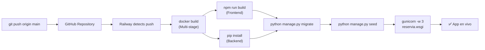

# Railway Deployment

[[Home|← Volver al Home]]

## Overview

Reservia está desplegado en **Railway.app**, una plataforma de cloud hosting que soporta Docker nativo y auto-deploy desde GitHub.

**URL de producción**: https://reservia.up.railway.app

---

## 🚂 ¿Por qué Railway?

| Ventaja | Descripción |
|---------|-------------|
| Docker nativo | Usa el `Dockerfile` del repo directamente |
| Auto-deploy | Push a `main` → deploy automático |
| PostgreSQL incluido | Servicio de base de datos integrado |
| Variables de entorno | Panel de configuración visual |
| SSL automático | HTTPS sin configuración |
| Sin costo fijo | Pay-as-you-go |

---

## 🛠️ Configuración del Proyecto

### Estructura en Railway

```
Railway Project: reservia
├── Service: backend (Web)
│   ├── Source: GitHub repo
│   ├── Build: Dockerfile
│   └── Variables: todas las env vars
└── Service: database (opcional)
    └── PostgreSQL plugin
```

---

## ⚙️ Variables de Entorno en Railway

Configurar en el panel de Railway → Service → Variables:

```
SECRET_KEY=<generar con python manage.py generate_secret_key>
DEBUG=False
ALLOWED_HOSTS=*.railway.app,reservia.up.railway.app
DATABASE_URL=${{Postgres.DATABASE_URL}}  # Referencia al plugin PostgreSQL
CORS_ALLOWED_ORIGINS=https://reservia.up.railway.app
ANTHROPIC_API_KEY=sk-ant-api03-...
PORT=8000
```

> [!info] `${{Postgres.DATABASE_URL}}`
> Railway permite referenciar variables de otros servicios. Esta sintaxis inserta automáticamente la URL de PostgreSQL.

---

## 🚀 Proceso de Deploy



---

## 📋 Checklist de Despliegue

- [ ] Conectar repositorio GitHub a Railway
- [ ] Configurar variables de entorno
- [ ] Añadir PostgreSQL plugin (o usar SQLite)
- [ ] Verificar que `ALLOWED_HOSTS` incluye el dominio Railway
- [ ] Verificar que `CORS_ALLOWED_ORIGINS` incluye el dominio Railway
- [ ] Hacer push del código
- [ ] Verificar logs del build
- [ ] Probar la URL de producción

---

## 🔍 Monitoreo y Logs

**Ver logs en tiempo real**:
```bash
# Via Railway CLI
railway logs

# Via GitHub + Railway
# Panel de Railway → Service → Deployments → Ver logs
```

**Logs de inicio esperados**:
```
Running migrations...
Seeding database...
[2025-01-01 12:00:00] [1] [INFO] Starting gunicorn 21.2.0
[2025-01-01 12:00:00] [1] [INFO] Listening at: http://0.0.0.0:8000
[2025-01-01 12:00:00] [9] [INFO] Booting worker with pid: 9
```

---

## 🔧 Railway CLI

```bash
# Instalar
npm install -g @railway/cli

# Login
railway login

# Conectar al proyecto
railway link

# Ver variables
railway variables

# Deploy manual
railway up

# Ver logs
railway logs
```

---

## ⚡ Configuración de Puerto

Railway inyecta automáticamente la variable `PORT`. El Dockerfile lo usa:

```dockerfile
CMD gunicorn -w 3 reservia.wsgi:application --bind 0.0.0.0:$PORT
```

> [!warning] No hardcodear el puerto
> Railway asigna el puerto dinámicamente. Siempre usar `$PORT`.

---

## 🔗 Links Relacionados

- [[Docker Setup]] — Dockerfile que Railway ejecuta
- [[Environment Variables]] — Variables de entorno detalladas
- [[Local Setup]] — Setup de desarrollo local
