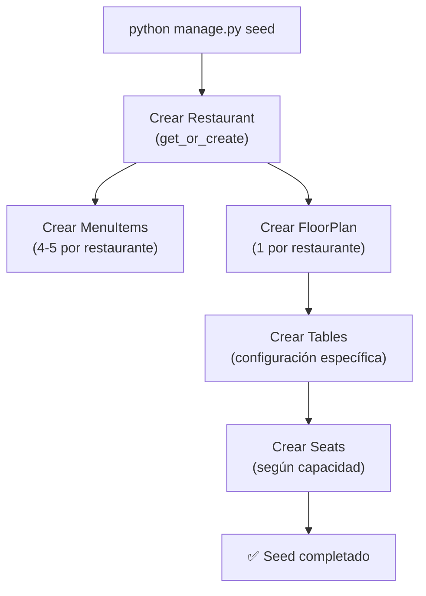

# Database Seeding

[[Home|← Volver al Home]]

## Overview

El comando `seed` popula la base de datos con datos de prueba: 6 restaurantes completos con menús, planos de piso, mesas y asientos.

**Archivo**: `backend/api/management/commands/seed.py`

---

## 🚀 Ejecutar el Seed

```bash
# Desde /backend con venv activado
python manage.py seed
```

> [!info] Idempotente
> El seed es idempotente — si ya existen datos, no duplica. Usa `get_or_create` o verifica existencia antes de crear.

> [!info] Auto-ejecutado en Docker
> En producción y Docker, el seed se ejecuta automáticamente al iniciar:
> ```
> CMD python manage.py migrate --noinput && python manage.py seed && gunicorn...
> ```

---

## 🍽️ Restaurantes Creados

### 1. The Golden Fork 🍝
- **Cocina**: Italian
- **Rating**: 4.8 | **Precio**: `$$`
- **Mesas**: 10 (mix de redondas, cuadradas, rectangulares)
- **Asientos**: ~40 en total
- **Menú**: Pasta Carbonara, Risotto, Tiramisu, Bruschetta, Pizza Margherita

### 2. Sakura Gardens 🌸
- **Cocina**: Japanese
- **Rating**: 4.7 | **Precio**: `$$$`
- **Mesas**: 8 (estilo minimalista)
- **Menú**: Sashimi, Ramen, Tempura, Mochi, Edamame

### 3. Prime Cuts 🥩
- **Cocina**: Steakhouse
- **Rating**: 4.6 | **Precio**: `$$$`
- **Mesas**: 7 (espaciosas)
- **Menú**: Ribeye, Filet Mignon, Lobster Tail, Caesar Salad, Cheesecake

### 4. El Centro Fusion 🌮
- **Cocina**: Fusion
- **Rating**: 4.5 | **Precio**: `$$`
- **Mesas**: Variadas (configuración amplia)
- **Menú**: Tacos de atún, Gyoza, Ceviche, Pad Thai, Brownie

### 5. Green Leaf 🥗
- **Cocina**: Healthy
- **Rating**: 4.4 | **Precio**: `$`
- **Mesas**: Configuración orgánica
- **Menú**: Buddha Bowl, Smoothie Bowl, Quinoa Salad, Avocado Toast, Açaí Bowl

### 6. Petit Paris Bistro 🥐
- **Cocina**: French
- **Rating**: 4.9 | **Precio**: `$$$`
- **Mesas**: Estilo bistró clásico
- **Menú**: Croissant, Crêpes, Coq au Vin, Bouillabaisse, Crème Brûlée

---

## 🏗️ Proceso de Seeding



---

## 🪑 Generación de Asientos

Para cada mesa, se generan automáticamente los asientos según la capacidad:

```python
# seed.py
letters = 'ABCDEFGHIJKLMNOPQRSTUVWXYZ'

for i in range(table.capacity):
    Seat.objects.get_or_create(
        table=table,
        seat_index=i,
        defaults={
            'label': f"{table.label}-{letters[i]}"
        }
    )
```

**Ejemplo**: Mesa "T1" con `capacity=4`:
- `T1-A` (seat_index=0)
- `T1-B` (seat_index=1)
- `T1-C` (seat_index=2)
- `T1-D` (seat_index=3)

---

## 📐 Configuración de Planos por Restaurante

Cada restaurante tiene un diseño único de floor plan:

| Restaurante | Estilo | Formas de mesas |
|------------|--------|-----------------|
| The Golden Fork | Clásico europeo | Round, square, rectangular |
| Sakura Gardens | Minimalista | Rectangular, square |
| Prime Cuts | Espacioso | Large rectangular |
| El Centro Fusion | Dinámico | Mixed shapes |
| Green Leaf | Orgánico | Round |
| Petit Paris Bistro | Bistró parisino | Small round & square |

---

## 🔄 Resetear y Re-seedar

```bash
# Opción 1: Solo limpiar datos
python manage.py flush --noinput
python manage.py seed

# Opción 2: Limpiar todo (incluye esquema)
rm db.sqlite3
python manage.py migrate
python manage.py seed

# Opción 3: Desde Docker
docker-compose down -v
docker-compose up --build
```

---

## 📍 Coordenadas GPS

Los restaurantes tienen coordenadas reales para funcionar con el [[Map Explorer]]:

```python
# Aproximadamente área de Manhattan, NY
restaurants_data = [
    {'name': 'The Golden Fork', 'lat': 40.7128, 'lng': -74.0060},
    {'name': 'Sakura Gardens',  'lat': 40.7218, 'lng': -73.9856},
    # ...
]
```

---

## 🔗 Links Relacionados

- [[Local Setup]] — Cómo ejecutar el seed en desarrollo
- [[Database Schema]] — Modelos que se crean
- [[Floor Plan System]] — Planos que se generan
- [[Docker Setup]] — Seed automático en Docker
