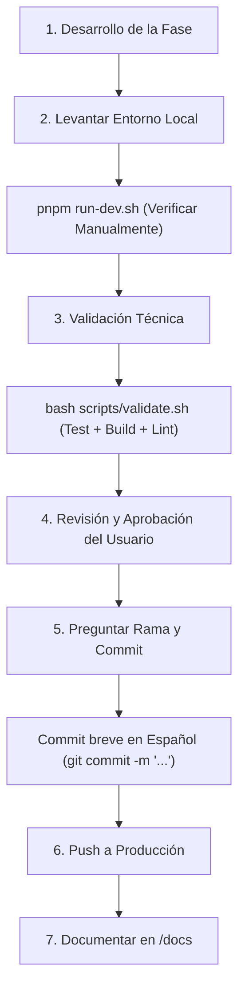

# 🚀 PLAN DE DESARROLLO POR FASES — ReserVia

Este documento detalla el plan de desarrollo estructurado en **5 fases** para la implementación de las nuevas funcionalidades críticas de **ReserVia**. Cada fase representa una tarea completa y debe seguir de forma estricta el **Protocolo de Integración y Despliegue** establecido para asegurar la estabilidad en producción.

---

## 📋 PROTOCOLO DE INTEGRACIÓN Y DESPLIEGUE (OBLIGATORIO)

Para cada una de las fases, se debe seguir exactamente este flujo de trabajo. No se permite omitir ningún paso.



### Detalle de los Pasos:

1. **Desarrollo**: Implementar los cambios en el frontend y backend según los requisitos de la fase.
2. **Levantar Entorno Local**: Ejecutar `./run-dev.sh` desde la raíz para iniciar el backend (Django con base de datos SQLite seeded) y el frontend (Vite con `pnpm` y dependencias al día). Hacer pruebas manuales exhaustivas de la interfaz y flujos de datos.
3. **Validación Técnica**: Una vez que la funcionalidad sirva correctamente en local, ejecutar:
   ```bash
   bash scripts/validate.sh
   ```
   *Nota: Este script compilará el frontend (`pnpm build`), comprobará tipos, pasará linter (`pnpm lint`), ejecutará los tests de Vitest y las pruebas unitarias del backend en Django.*
4. **Revisión del Usuario**: Notificar al usuario que la fase está completada en local para que realice su propia comprobación visual e interactiva.
5. **Preguntar por el Commit**: Una vez que el usuario dé el visto bueno, **preguntar explícitamente en qué rama se debe realizar el commit** y proceder a crear el commit.
   * **Regla de Commit**: El mensaje de commit debe estar en **español**, ser **breve** y conciso (máximo 50 caracteres).
     * *Ejemplo correcto:* `git commit -m "feat: login con google oauth en produccion"`
6. **Push a Producción**: Subir los cambios a la rama indicada por el usuario para su despliegue automatizado en producción.
7. **Documentación Obligatoria**: Crear o actualizar un archivo de documentación en formato `.md` dentro de la carpeta `docs/05-Features/` detallando:
   * Arquitectura y flujo de la funcionalidad.
   * Problemas y bloqueos encontrados.
   * Soluciones aplicadas.
   * Pruebas realizadas.

---

## 🛠️ FASES DE DESARROLLO

---

### 🔑 FASE 1: Conectar Google OAuth a la App Web de Producción (reservia.website)

#### 🎯 Objetivos:
Permitir a los usuarios registrarse e iniciar sesión utilizando su cuenta de Google de forma fluida en el dominio de producción `https://reservia.website` y en el entorno local.

#### 🚶‍♂️ Pasos de Implementación y Configuración:
1. **Configuración en Google Cloud Console (API & Services)**:
   * **Pantalla de Consentimiento OAuth (OAuth Consent Screen)**:
     * Configurar el tipo de usuario como **Externo**.
     * Añadir el nombre de la aplicación: **ReserVia**.
     * Configurar correos de soporte de usuario y contacto del desarrollador.
     * En **Dominios autorizados**, agregar: `reservia.website`
     * Enlaces obligatorios de la aplicación:
       * Página de inicio: `https://reservia.website`
       * Enlace a políticas de privacidad: `https://reservia.website/privacy` (o genérico temporal)
       * Enlace a términos de servicio: `https://reservia.website/terms` (o genérico temporal)
   * **Credenciales de Cliente OAuth 2.0 (Credenciales -> Crear credenciales -> ID de cliente de OAuth)**:
     * Tipo de aplicación: **Aplicación web**.
     * Nombre: **ReserVia Producción & Local**.
     * **Orígenes de JavaScript autorizados**:
       * Local: `http://localhost:5173`
       * Producción: `https://reservia.website` y `https://www.reservia.website`
     * **URIs de redireccionamiento autorizados**:
       * Local Frontend: `http://localhost:5173`
       * Local Backend endpoint: `http://localhost:8000/api/auth/google/`
       * Producción Frontend: `https://reservia.website` y `https://www.reservia.website`
       * Producción Backend endpoint: `https://reservia.website/api/auth/google/`
2. **Backend (Django)**:
   * Validar que en el entorno de producción (`.env` de producción en Railway / VPS) y en local estén configurados de forma correcta:
     * `GOOGLE_CLIENT_ID` = `[TU_CLIENT_ID].apps.googleusercontent.com`
     * `GOOGLE_CLIENT_SECRET` = `[TU_CLIENT_SECRET]`
   * Comprobar que en `backend/api/views_auth.py`, la validación con `id_token.verify_oauth2_token` utiliza `django_settings.GOOGLE_CLIENT_ID` cargado del entorno sin fallos de lectura.
3. **Frontend (React)**:
   * Configurar el wrapper del proveedor en el punto de entrada principal o dentro de `AuthModal.tsx` utilizando `@react-oauth/google` o la SDK nativa cargada mediante `https://accounts.google.com/gsi/client`.
   * Proveer el ID de cliente de Google (`import.meta.env.VITE_GOOGLE_CLIENT_ID`).
   * Al recibir la credencial del callback (`credential`), enviarla mediante una petición POST al endpoint de Django `https://reservia.website/api/auth/google/` (o local via proxy `/api/auth/google/`).
   * Manejar la respuesta del servidor, decodificar el token JWT devuelto, guardar en `AuthContext` y redirigir al usuario con su sesión activa.

#### 🔐 Variables de Entorno & Secretos:
* **Entorno de Producción & .env Local**:
  * `GOOGLE_CLIENT_ID` (ID de Cliente generado por Google Cloud Console)
  * `GOOGLE_CLIENT_SECRET` (Secreto de cliente generado por Google Cloud Console)
  * `FRONTEND_URL` (Debe ser `https://reservia.website` en producción y `http://localhost:5173` en local)

#### 📝 Ubicación de la Documentación:
* **Archivo**: `docs/05-Features/Google_OAuth_Production.md`
* [Ver Plantilla de Documentación](#-plantilla-de-documentacion-de-fase)

---

### 👑 FASE 2: Secreto de Administrador y Dashboard de Administrador

#### 🎯 Objetivos:
Proteger el acceso al Dashboard de Administrador (`AdminDashboard.tsx`) mediante un código o token secreto robusto de administración y habilitar vistas de métricas globales del sistema.

#### 🚶‍♂️ Pasos de Implementación:
1. **Seguridad y Acceso (Backend & Frontend)**:
   * Definir un secreto en las variables de entorno de producción y local llamado `ADMIN_DASHBOARD_SECRET`.
   * Crear un middleware o validar en el endpoint `GET /api/admin/stats/` que la petición incluya un header de autenticación o que el usuario administrador esté validado con este secreto de manera complementaria.
   * En el frontend, agregar un modal o prompt de verificación en `/admin` que solicite el secreto si el usuario no lo ha ingresado previamente, guardándolo de forma segura (encriptada o en sesión).
2. **Mejora del Dashboard de Administrador**:
   * Asegurar que `AdminDashboard.tsx` consuma los endpoints reales:
     * `GET /api/admin/stats/` (métricas de ingresos estimados, etc.).
     * `GET /api/admin/top-restaurants/` (restaurantes populares).
     * `GET /api/admin/city-distribution/` (distribución geográfica).
   * Implementar el gráfico de ingresos estimados (`estimatedRevenue`) usando Chart.js / Recharts (resolviendo el GAP-09).
   * Desmockear cualquier dato estático restante en las tarjetas del dashboard.

#### 🔐 Variables de Entorno & Secretos:
* `ADMIN_DASHBOARD_SECRET` (Clave secreta para el acceso al panel administrativo).

#### 📝 Ubicación de la Documentación:
* **Archivo**: `docs/05-Features/Admin_Dashboard_Verificado.md`
* [Ver Plantilla de Documentación](#-plantilla-de-documentacion-de-fase)

---

### 🏪 FASE 3: Secreto de Owner de Restaurante en GitHub y Dashboard de Restaurante

#### 🎯 Objetivos:
Configurar de forma segura las credenciales de despliegue para propietarios en GitHub Actions y optimizar el Dashboard de Propietario (`OwnerDashboard.tsx`) eliminando datos mockeados y conectándolo al flujo real.

#### 🚶‍♂️ Pasos de Implementación:
1. **Secretos en GitHub**:
   * Registrar en el repositorio de GitHub las variables de entorno necesarias para la creación automática de códigos de Staff y accesos de propietario durante el despliegue continuo (CI/CD).
2. **Mejora del Dashboard de Restaurante**:
   * **Plano de Mesas Real (GAP-03)**: Reemplazar el layout hardcodeado por una llamada real al endpoint `GET /api/restaurants/{id}/tables/` para pintar el plano dinámicamente con estados de disponibilidad reales (`free`, `taken`, `reserved`).
   * **Conexión de Endpoints**:
     * `GET /api/owner/stats/` (estadísticas reales de reservas y distribución horaria).
     * `GET /api/owner/reservations/` (gestión de la lista de reservas con paginación y filtros reales).
     * `PATCH/POST /api/owner/reservations/{id}/status/` (actualizar estado a Confirmada/Cancelada/Completada).
3. **Gestión de Códigos de Staff (`StaffCode`)**:
   * Asegurar que el formulario de onboarding de propietario (`OwnerOnboarding`) valide correctamente con el modelo `StaffCode` real del backend (resolviendo el GAP-01).

#### 🔐 Variables de Entorno & Secretos:
* **GitHub Secrets**:
  * `RESTAURANT_OWNER_REGISTRATION_SECRET` (Código base para autorizar a nuevos dueños de restaurantes a registrarse).

#### 📝 Ubicación de la Documentación:
* **Archivo**: `docs/05-Features/Owner_Dashboard_Optimized.md`
* [Ver Plantilla de Documentación](#-plantilla-de-documentacion-de-fase)

---

### 🤖 FASE 4: Integración de IA en el Dashboard de Restaurante

#### 🎯 Objetivos:
Añadir capacidades de inteligencia artificial predictiva y de análisis de datos para los dueños de restaurantes en su Dashboard.

#### 🚶‍♂️ Pasos de Implementación:
1. **Conexión con OpenRouter (Backend)**:
   * Utilizar la clave `OPENROUTER_API_KEY` (usando el modelo gratuito `google/gemma-3-4b-it:free` como se especifica en la configuración).
   * Crear un nuevo endpoint `POST /api/owner/ai-insights/` exclusivo para propietarios de restaurantes.
   * Este endpoint debe armar un prompt contextual con:
     * El historial de reservas del restaurante de las últimas semanas.
     * La distribución de horas pico.
     * Valoración media y comentarios de reseñas recientes.
     * Menú y platos más solicitados.
2. **Frontend (Componente IA)**:
   * Diseñar una sección atractiva llamada "Asistente ReserVia IA" dentro del `OwnerDashboard.tsx`.
   * Mostrar un panel interactivo con recomendaciones predictivas automáticas (ej. "Detectamos un pico de reservas los jueves a las 21:00, te recomendamos reforzar personal") y un chat rápido para que el propietario pregunte cosas específicas sobre sus datos de negocio (ej. "¿Cómo puedo mejorar las reseñas de mis postres?").

#### 🔐 Variables de Entorno & Secretos:
* `OPENROUTER_API_KEY` (Clave de API para acceder al modelo Gemma 3).

#### 📝 Ubicación de la Documentación:
* **Archivo**: `docs/05-Features/Restaurant_AI_Dashboard.md`
* [Ver Plantilla de Documentación](#-plantilla-de-documentacion-de-fase)

---

### ⭐ FASE 5: Sistema de Reseñas en el Detalle del Restaurante

#### 🎯 Objetivos:
Completar e integrar de punta a punta el sistema de reviews, permitiendo que clientes reales envíen calificaciones y comentarios detallados, y visualicen la distribución de estrellas de cada restaurante.

#### 🚶‍♂️ Pasos de Implementación:
1. **Backend (Modelos & Endpoints)**:
   * Consolidar el modelo `Review` y el recálculo dinámico del rating del restaurante.
   * Implementar de forma opcional (GAP-10) los sub-ratings: `food_rating`, `service_rating`, `ambiance_rating` en el modelo y serializador si se desea mayor granularidad.
   * Asegurar que el endpoint `POST /api/restaurants/{id}/reviews/` valide que el usuario haya completado una reserva válida en ese restaurante previamente (`can_review` filter).
2. **Frontend (Pestaña Reseñas)**:
   * En `RestaurantDetails.tsx`, optimizar la pestaña "Reseñas" para consumir `GET /api/restaurants/{id}/reviews/`.
   * Diseñar un modal interactivo para "Escribir Reseña" con selector de estrellas (y sub-ratings si aplica) y campo de texto.
   * Mostrar un desglose visual de valoraciones (ej. porcentaje de reseñas de 5 estrellas, 4 estrellas, etc.).
   * Asegurar que al enviar la reseña, se recargue la lista de reviews y se actualice el promedio global de la tarjeta del restaurante instantáneamente.

#### 📝 Ubicación de la Documentación:
* **Archivo**: `docs/05-Features/Restaurant_Reviews_System.md`
* [Ver Plantilla de Documentación](#-plantilla-de-documentacion-de-fase)

---

## 🗂️ PLANTILLA DE DOCUMENTACIÓN DE FASE

Cada archivo de documentación creado en `docs/05-Features/` debe seguir esta estructura limpia y profesional para mantener el estándar de calidad del proyecto:

```markdown
# 📖 [Fase X] — [Nombre de la Funcionalidad]

> **Fecha de Implementación**: AAAA-MM-DD
> **Estado**: Completado / En Producción
> **Rama de Git**: `feature/...`

---

## 🏛️ 1. Arquitectura y Flujo

[Explicar brevemente cómo funciona la característica de punta a punta. Se recomienda incluir un pequeño diagrama de flujo o texto explicativo sobre cómo se comunican el frontend, el backend y los servicios externos (Google OAuth, OpenRouter, etc.).]

---

## 🛠️ 2. Detalles de Implementación

### Backend
- **Modelos**: [Cambios o modelos creados]
- **Endpoints**: [Detalle de URLs y métodos HTTP]
- **Permisos y Seguridad**: [Políticas aplicadas]

### Frontend
- **Componentes**: [Listado de componentes creados/modificados]
- **Manejo de Estado**: [Uso de contexts o hooks]

---

## 🚨 3. Problemas Detectados y Soluciones

### 💥 Bloqueo 1: [Breve título del problema]
* **Descripción**: [Qué causó el error o bloqueo]
* **Solución**: [Cómo se solucionó, incluyendo fragmentos de código relevantes]

### 💥 Bloqueo 2: [Breve título del problema]
* **Descripción**: [Qué causó el error o bloqueo]
* **Solución**: [Cómo se solucionó]

---

## 🧪 4. Registro de Pruebas y Validación

### Pruebas Unitarias
- [x] Ejecución exitosa de `python manage.py test` para los nuevos endpoints.
- [x] Ejecución exitosa de `pnpm test:run` para los componentes interactivos.

### Pruebas Manuales
- **Caso de Prueba 1**: [Pasos y resultado esperado]
- **Caso de Prueba 2**: [Pasos y resultado esperado]

---

## 🧠 5. Lecciones Aprendidas y Deuda Técnica
- [¿Qué mejoras futuras se pueden aplicar en la siguiente versión? ¿Qué código se optimizó?]
```

---

## 🚀 CÓMO EMPEZAR

Para iniciar con la **Fase 1**, asegúrate de que tu entorno local esté limpio y actualizado:

```bash
git checkout main
git pull
./run-dev.sh
```

Una vez verificado que todo arranca de manera correcta, crea la rama de desarrollo correspondiente e inicia la codificación siguiendo el **Protocolo de Integración y Despliegue**. ¡A por ello!
