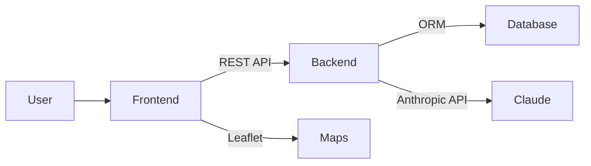

# 🍽️ Reservia — Documentación

> [!abstract] ¿Qué es Reservia?
> **ReserVia** es una plataforma de reservas de restaurantes con integración de IA. Permite descubrir restaurantes, explorarlos en un mapa interactivo, seleccionar mesas visualmente y hacer reservas con asistencia de un chatbot impulsado por Claude.

**Live**: https://reservia.up.railway.app

---

## 🗺️ Índice de Documentación

### 📋 Overview
- [[Project Overview]] — Qué es, para qué sirve, funcionalidades principales
- [[Tech Stack]] — Todas las tecnologías usadas

### 🏗️ Arquitectura
- [[System Architecture]] — Visión general del sistema y flujo de datos
- [[Project Structure]] — Estructura de carpetas y archivos clave
- [[Database Schema]] — Modelos y relaciones de base de datos

### ⚙️ Backend
- [[API Endpoints]] — Todas las rutas REST disponibles
- [[Authentication]] — Sistema JWT, tokens, permisos
- [[Models]] — Modelos Django detallados
- [[AI Chat Integration]] — Integración con Claude (Anthropic)

### 🖥️ Frontend
- [[Pages & Routing]] — Páginas y rutas de React Router
- [[Components]] — Componentes reutilizables
- [[State Management]] — AuthContext y estado global
- [[Internationalization]] — i18n EN/ES

### ✨ Funcionalidades
- [[Restaurant Discovery]] — Búsqueda y filtrado de restaurantes
- [[Reservation System]] — Flujo completo de reservas
- [[Floor Plan System]] — Editor visual de planos y selección de asientos
- [[Map Explorer]] — Mapa interactivo con geolocalización

### 🚀 Despliegue
- [[Docker Setup]] — Dockerfile multi-stage y docker-compose
- [[Environment Variables]] — Variables de entorno necesarias
- [[Railway Deployment]] — Despliegue en Railway.app

### 🛠️ Desarrollo
- [[Local Setup]] — Cómo correr el proyecto en local
- [[Database Seeding]] — Datos de prueba pre-cargados

---

## 🔑 Quick Reference

| Área | Tecnología |
|------|-----------|
| Frontend | React 19 + TypeScript + Vite |
| Styling | Tailwind CSS v4 |
| Backend | Django 4.2 + DRF |
| Database | SQLite (dev) / PostgreSQL (prod) |
| Auth | JWT (SimpleJWT) |
| IA | Anthropic Claude Haiku 4.5 |
| Deploy | Docker + Railway |
| Mapa | Leaflet.js |
| i18n | i18next (EN/ES) |

---

## 📊 Diagrama Rápido

